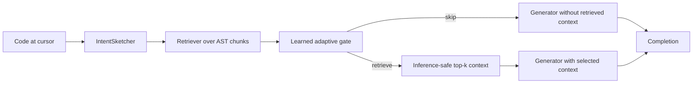
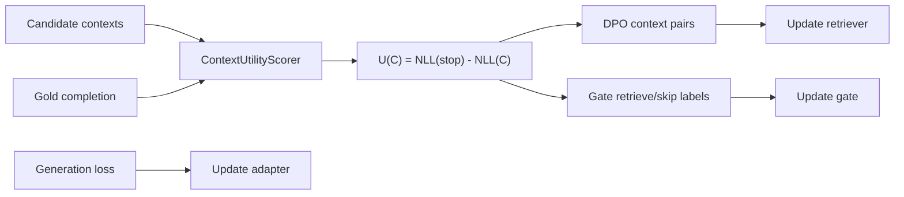

# Intent-Conditioned Adaptive Co-Retrieval

## 0. Paper Thesis

Tên đề xuất:

**Intent-Conditioned Adaptive Co-Retrieval for Repository-Level Code Completion**

Luận điểm chính:

> Repository-level code completion không chỉ cần retrieval mạnh hơn. Nó cần retrieval được điều kiện hóa bởi ý định code đang viết dở, được tối ưu bằng utility thực tế trên generator, và có cơ chế biết khi nào không nên retrieve.

Phiên bản lý thuyết này thay thế claim cũ "raw left-context RL retriever + soft prompt". Claim cũ chưa đủ mạnh để cạnh tranh với hướng query enhancement của AlignCoder. Bản mới đặt novelty ở ba điểm có khả năng publish hơn:

1. **Intent-conditioned retrieval query**: không dùng raw left context đơn thuần, mà xây query từ incomplete prefix, member access, imports, class hints, local identifiers và tail context.
2. **Context utility training signal**: đánh giá từng context bằng mức giảm NLL so với không retrieve:

```text
U(C) = NLL(stop) - NLL(C)
```

3. **Adaptive retrieve/skip gate**: gate không học từ pair retrieve-vs-retrieve mơ hồ, mà học từ nhãn utility:

```text
retrieve_is_better = max_C U(C) > utility_margin
```

Nếu muốn claim outperform trong thực tế, paper phải chứng minh ba ý này cùng đóng góp, không chỉ chứng minh pipeline chạy được.

## 1. Problem Setting

Repository-level code completion cần sinh target completion tại cursor dựa trên:

- left context trong file hiện tại;
- scope hiện tại: imports, class/function signature, local variables, decorators;
- cross-file definitions: function, class, method, constant trong cùng repository;
- usage patterns: cách các symbols được dùng ở file khác.

Khó khăn cốt lõi: code tại cursor thường đang viết dở. Raw left context có thể chứa identifier cụt, member access chưa hoàn thành, hoặc hàm/class chưa được gọi ra tên. Vì vậy semantic gap giữa query và evidence trong repository rất lớn.

Ví dụ:

```python
client = PaymentClient(...)
client.ref
```

Raw query chỉ có `client.ref`, trong khi evidence đúng có thể nằm ở `refund_payment`, `RefundRequest`, hoặc method `create_refund`. Retriever tốt phải đoán được intent từ scope và pattern, không chỉ matching text.

## 2. Prior Work Và Khoảng Trống

### 2.1 RepoCoder

[RepoCoder](https://arxiv.org/abs/2303.12570) xây iterative retrieval-generation framework cho repository-level code completion. Điểm mạnh là dùng retrieval để đưa cross-file context vào prompt, nhưng retriever chủ yếu vẫn phụ thuộc vào tín hiệu truy vấn trực tiếp từ context hiện tại.

Giới hạn liên quan đến proposal này:

- chưa tối ưu retriever bằng utility trực tiếp của generator;
- chưa có retrieve/skip decision được học từ sample-level utility;
- chưa giải quyết triệt để incomplete-query semantic gap.

### 2.2 CrossCodeEval

[CrossCodeEval](https://arxiv.org/abs/2310.11248) nhấn mạnh bài toán completion cần cross-file context và cung cấp benchmark phù hợp để đo repository-level completion.

Ý nghĩa với paper:

- CrossCodeEval nên là benchmark chính;
- nếu không đánh giá trên benchmark cross-file chuẩn, claim "repository-level" sẽ yếu.

### 2.3 RLCoder

[RLCoder](https://arxiv.org/abs/2407.19487) train retriever bằng reinforcement learning, dùng feedback dựa trên perplexity/chất lượng completion, và có stop signal cho trường hợp không cần retrieval.

Điểm mạnh:

- dùng tín hiệu từ generator thay vì labeled retrieval data;
- nhận ra retrieval không phải lúc nào cũng có ích.

Giới hạn cần vượt:

- query vẫn dễ yếu khi left context đang incomplete;
- PPO/RL có chi phí và độ nhạy hyperparameter cao;
- stop/retrieve signal cần được nối rõ với utility cụ thể trên từng sample.

### 2.4 AlignCoder

[AlignCoder](https://arxiv.org/abs/2601.19697) nhận ra semantic gap giữa incomplete left context và target completion. Hướng chính là dùng Code LLM sinh sampled completions để enhance query, sau đó train retriever bằng RL.

Đây là đối thủ gần nhất và mạnh nhất về mặt novelty.

Điểm proposal này phải khác:

- không chỉ "train retriever tốt hơn";
- phải chứng minh intent-conditioned query là nguồn lợi ích độc lập;
- phải chứng minh utility gate giảm retrieval noise;
- phải chứng minh adapter/generator side thật sự giúp context được dùng tốt hơn.

Nếu không có ablation rõ, proposal sẽ bị reviewer xem là biến thể yếu của AlignCoder/RLCoder.

## 3. Research Gap Chính

### 3.1 Raw left context là query yếu

Raw left context không biểu diễn đủ intent khi code đang viết dở. Query cần chứa các hint có cấu trúc:

- incomplete prefix;
- owner trong member access;
- imports;
- class/type hints;
- local identifiers;
- tail context gần cursor.

Đây là lý do code hiện tại đã thêm `IntentSketcher`.

### 3.2 Retrieval utility là sample-specific

Cùng một retriever có thể giúp sample này nhưng hại sample khác. Vì vậy nhãn retrieval không nên là "chunk có overlap symbol" hoặc "chunk rank cao", mà nên là:

```text
context có làm giảm target NLL so với không retrieve hay không?
```

Đây là lý do code hiện tại đã thêm `ContextUtilityScorer`.

### 3.3 Gate phải học từ retrieve-vs-stop utility

Một lỗi lý thuyết cũ: dùng DPO pairs retrieve-vs-retrieve rồi kỳ vọng gate học được khi nào skip. Điều đó không đủ chặt.

Gate cần supervision riêng:

```text
positive gate label  = tồn tại retrieved context có U(C) > margin
negative gate label  = mọi retrieved context không vượt stop
```

Đây là lý do code hiện tại đã thêm `GateTrainingExample`.

### 3.4 Co-training chỉ có giá trị nếu thắng sequential

Claim co-training không được xem là hiển nhiên. Nó chỉ có giá trị khoa học nếu:

- retriever được tối ưu cho generator/adapter hiện tại;
- adapter học đọc loại context mà retriever đang chọn;
- pipeline alternating tốt hơn train tuần tự cùng budget.

Hiện code đã có alternating loop, nhưng baseline sequential vẫn cần bổ sung trước khi paper claim mạnh.

## 4. Method

### 4.0 Training vs Inference Separation

Điểm bắt buộc để tránh target leakage: `ContextUtilityScorer` chỉ thuộc training/analysis. Nó cần gold completion `Y` để tính `NLL(target | context)`, nên không được xuất hiện trong online inference.

Inference pipeline:



Training pipeline:



Inference chỉ dùng strategy trong whitelist:

```text
INFERENCE_SAFE_STRATEGIES = {current, bm25, dense_frozen, learned_retriever}
```

Mọi strategy target-aware như `oracle`, `hard_neg`, `target_symbol`, `gold_overlap`, `future_context` phải fail fast trong eval/predict. `hard_neg` chỉ hợp lệ trong preference construction hoặc stress-test analysis, không dùng main evaluation.

### 4.1 AST Chunking

Repository được chia thành code chunks theo entity:

- `global`: imports, constants, module-level statements;
- `function`: top-level function;
- `class_header`: class signature, bases, docstring;
- `method`: method kèm class context;
- `class_body`: class không có method rõ;
- `fallback`: line-based block nếu parse lỗi.

AST chunking không phải novelty chính. Nó là hạ tầng để candidate context có boundary hợp lý hơn fixed-size windows.

### 4.2 Intent Sketch

Thay vì query:

```text
left_context
```

pipeline dùng:

```text
IntentSketch(left_context) =
  incomplete_prefix
  member_owner
  member_prefix
  imports
  class_hints
  local_identifiers
  left_context_tail
```

Trong code, phần này tương ứng với:

- `src/co_retrieval/intent.py`
- `IntentSketcher.build_query`
- config `intent_mode = "static"`
- experiment `raw_query_main` để ablate về raw query.

Lý thuyết khả thi:

- Static intent sketch rẻ hơn query enhancement bằng generated completions.
- Nó không hallucinate API mới vì chỉ lấy hint từ context hiện có.
- Nhưng nó cũng yếu hơn LLM-generated query khi intent cần suy luận sâu. Vì vậy paper phải đo `intent_main` vs `raw_query_main`, và nếu có thời gian nên thêm LLM intent draft như extension.

### 4.3 Context Utility

Mỗi sample tạo nhiều strategy candidate:

- `stop`: không retrieve;
- `bm25`: lexical retrieval;
- `dense_frozen`: frozen encoder baseline;
- `current`: retriever hiện tại;
- `hard_neg`: chunk rank cao nhưng symbol không liên quan;
- `oracle`: chunk overlap target symbol, chỉ dùng train/analysis.

Mỗi candidate được chấm bằng teacher-forcing NLL:

```text
NLL(stop) = NLL(target | left_context)
NLL(C)    = NLL(target | C, left_context, adapter)
U(C)      = NLL(stop) - NLL(C)
```

Diễn giải:

- `U(C) > 0`: context giúp generator dự đoán target tốt hơn;
- `U(C) = 0`: stop baseline;
- `U(C) < 0`: retrieval gây nhiễu.

Trong code, phần này tương ứng với:

- `src/co_retrieval/context_utility.py`
- `ContextUtilityScorer.score`
- `PreferencePair.chosen_utility`
- `PreferencePair.rejected_utility`
- config `utility_margin`.

Điểm quan trọng: đây không phải "không cần reward". Nó là một reward/utility rõ ràng, được định nghĩa bằng generator likelihood. Claim đúng phải là:

> DPO dùng utility-derived preferences nên tránh PPO rollout phức tạp, nhưng vẫn phụ thuộc vào thiết kế utility.

### 4.4 Preference Optimization Cho Retriever

Sau khi sort candidates theo utility, tạo DPO pairs nếu:

```text
U(chosen) - U(rejected) >= preference_margin
```

DPO loss học tăng xác suất chọn context có utility cao hơn context có utility thấp hơn.

Lưu ý lý thuyết:

- DPO chỉ đáng tin khi utility ranking ổn định.
- Teacher-forcing NLL không hoàn toàn đồng nghĩa với exact match hoặc pass@k.
- Vì vậy evaluation phải đo cả NLL improvement và output metrics.

### 4.5 Adaptive Gate

Gate được train bằng nhãn:

```text
retrieve_is_better = max_{C != stop} U(C) > utility_margin
```

Inference:

- `gate_mode = "learned"`: dùng neural gate;
- `gate_mode = "always_retrieve"`: baseline retrieval mọi sample;
- `gate_mode = "always_skip"`: baseline no retrieval;
- `gate_mode = "rule"`: heuristic baseline.

Gate phải được báo cáo bằng:

- retrieval rate;
- positive/negative gate label ratio;
- NLL improvement theo nhóm retrieve vs skip;
- performance của learned gate so với always retrieve/always skip;
- gate calibration: AUC, F1, precision, recall, confusion matrix so với utility-derived labels.

Gate claim chỉ được defend theo hai mức:

1. **Adaptive quality improvement**: learned gate thắng `always_retrieve` trên output quality.
2. **Compute reduction without quality loss**: learned gate có EM drop <= 0.01, Edit Similarity drop <= 0.01, Identifier F1 drop <= 0.01, và retrieval-rate reduction >= 0.20 so với `always_retrieve`.

Nếu không đạt hai điều kiện trên, adaptive gate chỉ nên được viết là optional/efficiency component, không phải core novelty.

### 4.6 Generator Adapter

Code hiện tại hỗ trợ:

- `adapter_type = "soft_prompt"`;
- `adapter_type = "none"`.

Soft prompt là lựa chọn nhẹ, ít tham số, phù hợp để chứng minh generator-side adaptation. Tuy nhiên về mặt outperform, soft prompt có thể chưa đủ mạnh so với LoRA hoặc full fine-tuning.

Vì vậy claim hiện tại nên là:

> lightweight generator adaptation through soft prompt.

Không nên claim đã có LoRA nếu code chưa triển khai. LoRA nên là hướng bổ sung hoặc ablation sau.

### 4.7 Alternating Training Loop

Pipeline hiện tại:

```text
Phase 0: build AST chunk index
Phase 1: warm up soft prompt with mixed no-context/oracle/noisy context
Phase 2: build utility-ranked preference data
Phase 3: train retriever with DPO and train gate with utility labels
Phase 4: refresh index after retriever update
Phase 5: repeat alternating rounds
Phase 6: evaluate held-out samples
```

Điểm đúng:

- preference data được refresh theo generator/adapter hiện tại;
- retriever và gate không học từ static labels;
- index được refresh sau retriever update.

Điểm còn yếu:

- full retriever update có thể tốn VRAM;
- `oracle` phải tuyệt đối chỉ train/analysis, không leak vào inference.

Sequential baselines đã được định nghĩa để kiểm tra co-training:

- `sequential_adapter_first`: train adapter đủ tổng prompt steps, freeze adapter, build preference data đúng một lần, train retriever/gate đủ tổng DPO steps, refresh index một lần.
- `sequential_retriever_first`: build preference data với adapter disabled đúng một lần, train retriever/gate đủ tổng DPO steps, freeze retriever/gate, train adapter đủ tổng prompt steps bằng contexts từ retriever đã train, refresh index một lần.

Hai sequential baselines không được refresh preference data nhiều vòng; nếu refresh nhiều vòng thì baseline biến thành alternating trá hình. Paper phải ghi rõ cùng data, cùng model, cùng tổng prompt-gradient steps và cùng tổng DPO steps.

## 5. Experiment Design

### 5.1 Main Claim Cần Test

Không được chỉ chạy một mode rồi nói outperform. Cần ít nhất các so sánh:

| Mode | Mục đích |
|---|---|
| `intent_main` | full method |
| `raw_query_main` | chứng minh intent sketch có ích |
| `retriever_only` | chứng minh adapter có ích |
| `always_retrieve` | chứng minh learned gate có ích |
| `always_skip` | no-retrieval lower bound |
| `bm25` | lexical retrieval baseline |
| `dense_frozen` | frozen dense retriever baseline |
| `sequential_adapter_first` | adapter trước, retriever/gate sau, cùng tổng budget |
| `sequential_retriever_first` | retriever/gate trước, adapter sau, cùng tổng budget |

Nếu alternating không thắng cả hai sequential baselines, không nên giữ co-training như core novelty.

### 5.2 Benchmarks

Ưu tiên:

1. CrossCodeEval: benchmark chính cho cross-file code completion.
2. RepoEval hoặc benchmark repo-level tương đương: kiểm tra generalization.
3. Repo split nội bộ: chỉ dùng development/debug, không đủ cho paper claim.

### 5.3 Metrics

Output metrics:

- Exact Match;
- Edit Similarity;
- Identifier F1;
- pass@k nếu có execution/unit tests.

Training-signal metrics:

- NLL improvement;
- utility distribution;
- DPO pair count per sample;
- pair type counts: `current>stop`, `oracle>current`, `bm25>current`, v.v.;
- gate positive ratio;
- gate AUC/F1/precision/recall/confusion matrix;
- retrieval rate;
- oracle-hit@k hoặc symbol recall@k.

Efficiency metrics:

- train GPU hours;
- inference latency;
- tokens added by retrieval;
- memory footprint.

### 5.4 Điều Kiện Để Claim Outperform

Chỉ nên claim outperform nếu thỏa ít nhất:

1. `intent_main` thắng `raw_query_main` trên cùng data/model/budget.
2. `intent_main` thắng `bm25`, `dense_frozen`, `always_retrieve`, `always_skip`.
3. Learned gate đạt quality-improvement hoặc compute-without-quality-loss threshold so với `always_retrieve`.
4. Adapter mode thắng `retriever_only` hoặc ít nhất cải thiện NLL/output metrics.
5. Co-training thắng `sequential_adapter_first` và `sequential_retriever_first`.
6. So sánh với RLCoder/AlignCoder được chạy trên cùng benchmark, hoặc claim phải hạ xuống thành "competitive with prior retrieval-based methods".

Nếu thiếu mục 5 hoặc 6, không nên viết "state-of-the-art" trong paper.

## 6. Phản Biện Lý Thuyết

### 6.1 Điểm mạnh

Lý thuyết mới hợp lý hơn bản cũ vì:

- trực tiếp xử lý semantic gap của incomplete code bằng intent sketch;
- định nghĩa rõ context tốt/xấu bằng utility so với stop;
- tách gate supervision khỏi DPO ranking;
- có ablation modes tương ứng trong code;
- không claim sai rằng DPO loại bỏ reward design.

Đây là khung có khả năng publish hơn vì reviewer có thể kiểm tra từng hypothesis.

### 6.2 Rủi ro lớn nhất

**Rủi ro 1: Intent sketch static có thể yếu hơn AlignCoder.**

AlignCoder dùng generated completions để query enhancement, có thể suy luận intent sâu hơn static regex/scope hints. Nếu `intent_main` không thắng hoặc không cạnh tranh, cần thêm LLM-based intent draft:

```text
left_context -> cheap draft completion/symbol sketch -> retrieval query
```

Nhưng extension này phải kiểm soát hallucination bằng confidence hoặc multi-query.

**Rủi ro 2: Teacher-forcing NLL không luôn tương quan với generated quality.**

Context có thể giảm NLL target nhưng không cải thiện greedy/beam output. Vì vậy paper phải báo cáo cả NLL và generation metrics, cùng correlation giữa NLL improvement và Edit Similarity/Identifier F1. Nếu correlation thấp, đó là warning về divergence giữa MLE training và generation evaluation hoặc metric mismatch; không được tự động kết luận utility signal thất bại, nhưng phải hạ độ mạnh của claim.

**Rủi ro 3: Soft prompt có thể quá yếu.**

Nếu adapter không cải thiện rõ, contribution co-adaptation sẽ yếu. Khi đó cần:

- thêm LoRA adapter;
- hoặc hạ claim thành retriever/gate framework với optional generator adapter.

**Rủi ro 4: Full retriever update tốn chi phí.**

`jina-code-embeddings-1.5b` có thể nặng. Nếu OOM hoặc training quá chậm, cần hỗ trợ:

- freeze encoder + projection head;
- LoRA trên encoder;
- cached embeddings + late interaction lightweight scorer.

**Rủi ro 5: Oracle strategy có nguy cơ làm evaluation leak.**

Oracle chỉ được dùng để tạo upper-bound preference trong train/analysis. Inference và eval tuyệt đối không được gọi oracle. Code cần dùng inference-safe strategy whitelist thay vì blacklist: eval/predict chỉ chấp nhận `current`, `bm25`, `dense_frozen`, `learned_retriever`; mọi strategy target-aware hiện tại hoặc tương lai phải raise lỗi.

**Rủi ro 6: DPO trên context set không gán credit cho từng chunk.**

Nếu top-k gồm một chunk tốt và hai chunk nhiễu, DPO chỉ biết cả set tốt/xấu. Có thể cần chunk-level attribution hoặc leave-one-out utility:

```text
U(C_i | C_set) = NLL(C_set without C_i) - NLL(C_set)
```

Đây là extension, chưa cần cho bản đầu nếu results đủ mạnh.

### 6.3 Phản biện claim "outperform trong thực tế"

Lý thuyết có khả thi, nhưng chưa đủ để đảm bảo outperform. Để thật sự có khả năng vượt prior work, cần bổ sung thực nghiệm và có thể bổ sung code:

1. **Sequential baseline**: bắt buộc nếu muốn claim co-training.
2. **Official CrossCodeEval pipeline**: bắt buộc nếu muốn claim paper-level.
3. **LLM/semantic intent variant**: cần nếu static sketch thua AlignCoder-style query enhancement.
4. **LoRA/projection adapter option**: cần nếu soft prompt không đủ mạnh.
5. **Strict no-leak evaluation**: tách oracle/train/eval rõ ràng.

Nói ngắn gọn:

> Lý thuyết hiện tại đã rõ và hợp lý hơn nhiều, nhưng để "MAKE NO MISTAKE" theo chuẩn paper, không được dừng ở implementation. Phải có ablation chứng minh từng thành phần tạo lợi ích thật.

### 6.4 Fallback Claim And Title Hierarchy

Title/abstract phải hạ theo kết quả, không chỉ hạ ở phần conclusion:

| Kết quả ablation | Title/frame được phép |
|---|---|
| Alternating thắng cả hai sequential baselines | **Intent-Conditioned Adaptive Co-Retrieval for Repository-Level Code Completion** |
| Alternating không thắng sequential | **Utility-Driven Adaptive Retrieval for Repository-Level Code Completion** |
| Learned gate không đạt quality/compute threshold | **Utility-Supervised Retrieval for Repository-Level Code Completion** |
| Static intent sketch không thắng raw query | **Generator-Utility Supervision for Repository-Level Code Retrieval** |

Abstract và novelty statement phải theo cùng hierarchy. Nếu experiment phủ nhận một thành phần, thành phần đó phải chuyển thành analysis/engineering detail thay vì core contribution.

## 7. Code Alignment Checklist

Đã có trong code:

- `IntentSketcher` cho intent-conditioned query.
- `ContextUtilityScorer` với `U(C) = NLL(stop) - NLL(C)`.
- `PreferencePair` lưu NLL và utility của chosen/rejected.
- `GateTrainingExample` cho retrieve/skip labels.
- `PreferenceData` lưu pairs, gate examples và counters.
- Inference-safe strategy whitelist cho eval/predict.
- `experiment_mode`: `intent_main`, `raw_query_main`, `retriever_only`, `always_retrieve`, `always_skip`, `bm25`, `dense_frozen`, `sequential_adapter_first`, `sequential_retriever_first`.
- `intent_mode`: `static`, `raw`.
- `gate_mode`: `learned`, `always_retrieve`, `always_skip`, `rule`.
- `adapter_type`: `soft_prompt`, `none`.
- `utility_margin`, `preference_margin`, `max_pairs_per_sample`.
- Gate ablation và calibration metrics.
- NLL-output correlation và leave-one-out chunk utility analysis.
- Evaluation metrics: exact match, edit similarity, identifier F1, retrieval rate, NLL improvement.

Chưa đủ cho paper mạnh:

- official CrossCodeEval/RepoEval evaluation command;
- LoRA hoặc lightweight projection adapter;
- dùng leave-one-out vào training để giải quyết credit assignment, hiện chỉ analysis-only;
- statistical significance reporting;
- latency/memory reporting.

## 8. Final Novelty Statement

Novelty đầy đủ chỉ nên viết như sau khi ablations support full hierarchy:

> We propose an intent-conditioned adaptive co-retrieval framework for repository-level code completion. The method transforms incomplete left context into a structured intent sketch, ranks retrieval strategies by generator-side utility measured as NLL improvement over no retrieval, optimizes the retriever from utility-derived preferences, and trains a separate adaptive gate to retrieve only when context is expected to help. A lightweight generator adapter is alternated with retriever/gate updates so the retrieval policy and context consumer co-adapt.

Claim không nên viết:

> First RL retriever plus soft prompt for code completion.

Lý do:

- "first" khó bảo vệ;
- "RL retriever" làm proposal bị so trực tiếp với RLCoder/AlignCoder nhưng không nêu khác biệt cốt lõi;
- "soft prompt" có thể không phải contribution đủ mạnh nếu không có ablation thắng.

Claim nên viết:

> Utility-driven, intent-conditioned adaptive retrieval with generator-side lightweight adaptation.

Đây là claim vừa rõ, vừa test được, vừa khớp với code hiện tại. Nếu sequential/gate/intent ablations không đạt, title và abstract phải hạ theo bảng fallback ở Section 6.4.
