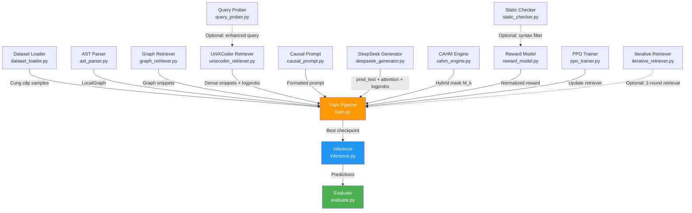

# 📋 Báo Cáo Phân Tích Repository: GraphFRL (Graph-Conditioned Fine-grained Reinforcement Retrieval)

> **Ngày tạo**: 31/05/2026  
> **Repo**: `CodeCompletion` (GraphFRL Framework)  
> **Mục đích**: Hệ thống Repository-Level Code Completion sử dụng Retrieval-Augmented Generation (RAG) kết hợp Reinforcement Learning và Graph-based Retrieval

---

## 1. Tổng Quan Dự Án

### 1.1 Bài toán đang giải quyết

**Repository-level Code Completion** — tự động hoàn thành code dựa trên ngữ cảnh không chỉ trong file hiện tại mà còn từ **nhiều file khác** trong cùng repository. Đây là bài toán khó hơn nhiều so với code completion thông thường vì cần hiểu:

- Cấu trúc import/dependency giữa các file
- Inheritance (kế thừa) giữa các class
- API calls xuyên file (cross-file function calls)
- Kiến trúc tổng thể của repository

### 1.2 Tên framework: **GraphFRL**

**Graph-Conditioned Fine-grained Reinforcement Retrieval** — Framework mới kết hợp:

1. **Graph-conditioned Retrieval**: Xây dựng đồ thị dependency từ repository, dùng đồ thị để tìm code liên quan
2. **Reinforcement Learning (PPO)**: Tối ưu hóa retriever bằng RL, dùng chất lượng code sinh ra làm reward
3. **Fine-grained Credit Assignment (CAHM)**: Cơ chế masking tinh vi để xác định chính xác phần nào của context thực sự giúp ích

### 1.3 Pipeline Tổng Thể

```
Repository Files
    ↓
[AST Parser] → Phân tích cú pháp, trích xuất import/class/function
    ↓
[Graph Retriever] → Xây dựng import graph, BFS tìm dependency chains
[UniXCoder Retriever] → Dense retrieval (BM25 + embedding similarity)
    ↓
[Causal Prompt Generator] → Ghép retrieved context + left context thành prompt
    ↓
[DeepSeek Generator] → Sinh code completion
    ↓
[CAHM Engine] → Đánh giá ảnh hưởng từng snippet (Attention + Ablation masking)
[Reward Model] → Tính reward (Edit Similarity + AST match + LLM Judge)
    ↓
[PPO Trainer] → Cập nhật retriever bằng policy gradient
```

---

## 2. Cấu Trúc Thư Mục

```
CodeCompletion/
├── data/                          # 📁 Xử lý dữ liệu & phân tích AST
│   ├── ast_parser.py              #     Trích xuất cấu trúc cú pháp (imports, class, function)
│   └── dataset_loader.py          #     Tải & xử lý dataset train/test
│
├── generator/                     # 📁 Module sinh code
│   ├── causal_prompt.py           #     Tạo prompt cho Code LLM
│   └── deepseek_generator.py      #     Wrapper cho DeepSeek-Coder (sinh code + trích xuất attention)
│
├── retriever/                     # 📁 Module truy vấn code
│   ├── unixcoder_retriever.py     #     Dense retriever (UniXCoder + BM25 pre-filter)
│   ├── graph_retriever.py         #     Graph-based retriever (import graph + BFS)
│   ├── query_prober.py            #     Deterministic Query Probing (thay thế AlignCoder sampling)
│   └── iterative_retriever.py     #     Graph-Guided Iterative Retrieval (2-round retrieval)
│
├── rl/                            # 📁 Module Reinforcement Learning
│   ├── cahm_engine.py             #     Causal-Attention Hybrid Masking
│   ├── reward_model.py            #     Composite Reward Model (3 tín hiệu)
│   ├── ppo_trainer.py             #     PPO optimizer + Value Head
│   └── static_checker.py          #     Kiểm tra cú pháp code sinh ra
│
├── train.py                       # 🚀 Script huấn luyện chính
├── evaluate.py                    # 📊 Đánh giá (EM, ES, Identifier F1)
├── inference.py                   # 🔍 Inference/Prediction trên test set
├── Novelty.md                     # 📝 Tài liệu phân tích novelty so với RLCoder/AlignCoder
└── research.txt                   # 📝 Bản thảo paper (abstract, methodology, experiments)
```

---

## 3. Phân Tích Chi Tiết Từng File

---

### 3.1 `data/ast_parser.py` — Bộ Trích Xuất Cấu Trúc AST

| Thuộc tính | Giá trị |
|---|---|
| **Kích thước** | 405 dòng, ~15.6 KB |
| **Dependency** | `tree-sitter`, `tree_sitter_languages` (optional) |
| **Mục đích** | Phân tích cú pháp source code để trích xuất thông tin cấu trúc quanh vị trí con trỏ |

#### Các class/function chính:

- **`LocalGraph`** (dataclass): Đối tượng lưu trữ thông tin cấu trúc cục bộ gồm:
  - `imports`: Danh sách câu lệnh import
  - `parent_class`: Class cha bao quanh con trỏ (nếu có)
  - `parent_function`: Function cha bao quanh con trỏ (nếu có)
  - `local_code`: Đoạn code cục bộ xung quanh vị trí con trỏ
  - `to_prompt_string()`: Chuyển thông tin cấu trúc thành chuỗi cho prompt

- **`ASTQueryExtractor`**: Bộ trích xuất chính, sử dụng Tree-sitter parser
  - `extract_local_graph(source_code, cursor_line)` → Trả về `LocalGraph`
  - `_extract_imports()` — Lấy imports trước con trỏ bằng AST traversal
  - `_extract_parent_class()` — Tìm class bao quanh con trỏ (deepest enclosing class)
  - `_extract_parent_function()` — Tìm function bao quanh con trỏ
  - `_extract_enclosing_block_range()` — Tìm block code (function/class) bao quanh
  - Tất cả đều có fallback heuristic (regex/text scan) nếu Tree-sitter không khả dụng

#### Thiết kế nổi bật:
- **Parser cache** (`_PARSER_CACHE`): Tránh tạo parser nhiều lần (Tree-sitter parser nặng)
- **Multi-language support**: Python, Java, JavaScript, TypeScript, Go, C++, C, Ruby
- **Fallback graceful**: Nếu Tree-sitter fail → dùng regex/text heuristic → vẫn trả kết quả

---

### 3.2 `data/dataset_loader.py` — Bộ Tải Dữ Liệu

| Thuộc tính | Giá trị |
|---|---|
| **Kích thước** | 699 dòng, ~28.3 KB |
| **Dependency** | `pandas`, `tree-sitter` |
| **Mục đích** | Tải dataset train (từ GitHub repos) & test (RepoEval, CCEval) |

#### Các thành phần chính:

- **`VALID_LINE_TYPES`**: Cấu hình AST node types cho từng ngôn ngữ, chia thành:
  - `line`: Statement đơn dòng (assignment, return, import...)
  - `block`: Statement nhiều dòng (if, for, function_definition...)
  - `mixed`: Kết hợp cả hai

- **Stratified Mixed Sampling**: Cơ chế lấy mẫu theo phân phối:
  - 70% line completion (hoàn thành 1 dòng)
  - 20% block completion (hoàn thành 1 block)
  - 10% mixed

- **`_ast_cut()`**: Chọn vị trí cắt (split point) bằng AST analysis:
  - Parse file bằng Tree-sitter
  - Tìm node phù hợp (đúng loại line/block, nằm trong vùng hợp lệ)
  - Random chọn 1 node → tạo left_context/ground_truth/right_context
  - Có constraints: MIN_ABS_LINES, MIN_REL_RATIO, MAX_REL_RATIO

- **`GraphFRLDataLoader`**:
  - `load_github_repos()` — Tải train data từ Parquet, gom file thành repo
  - `construct_train_sample_safe()` — Tạo 1 training sample với nhiều bộ lọc:
    - File phải đủ dài (≥200 dòng, ≥2000 ký tự)
    - Ground truth không được chỉ chứa comment hoặc import
    - Left context phải đủ dài (≥30 dòng)
  - `prepare_dataset()` — Pre-generate fixed training samples (AlignCoder-style)
  - `load_test_samples()` — Tải test set từ RepoEval/CCEval

#### Thiết kế nổi bật:
- **Fixed-train mode**: Pre-generate 2000 samples, cache trong RAM → train ổn định hơn
- **Strict filtering**: Loại bỏ sample kém chất lượng (comment-only, import-only, quá ngắn)
- **Multi-language AST cut**: Hỗ trợ 8 ngôn ngữ lập trình

---

### 3.3 `generator/causal_prompt.py` — Tạo Prompt Cho Code LLM

| Thuộc tính | Giá trị |
|---|---|
| **Kích thước** | 34 dòng, ~1.3 KB |
| **Mục đích** | Ghép retrieved context + left context thành prompt cho Code LLM |

#### Chi tiết:

- **`CausalPromptGenerator`**: Class đơn giản với 1 method chính:
  - `construct_prompt(retrieved_context, left_context, file_path)` → prompt string

- **Format prompt**:
  ```
  <retrieved context từ các file khác>

  # file path: <tên file hiện tại>
  <left context (code trước con trỏ)>
  ```

- Sử dụng phương pháp **Causal LM (left-to-right next-token prediction)** — phù hợp với thực tế IDE, chỉ dùng context bên trái.

---

### 3.4 `generator/deepseek_generator.py` — Wrapper Cho DeepSeek-Coder

| Thuộc tính | Giá trị |
|---|---|
| **Kích thước** | 97 dòng, ~4.3 KB |
| **Dependency** | `transformers` (HuggingFace) |
| **Model mặc định** | `deepseek-ai/deepseek-coder-1.3b-base` |
| **Mục đích** | Sinh code và trích xuất attention/logprobs cho RL training |

#### Các method chính:

- **`generate_with_attention(prompt, retrieved_tokens_len, max_new_tokens)`**:
  - Sinh code bằng autoregressive decoding
  - Trả về 3 giá trị:
    1. `pred_text`: Text code dự đoán
    2. `logprobs_tensor`: Log-probabilities của từng token sinh ra → dùng cho CAHM
    3. `cross_attn`: Ma trận attention layer cuối (trung bình qua heads) → đo mức độ model "chú ý" vào retrieved context

- **`score_sequence(prompt, target_text)`**:
  - Teacher forcing: Tính logprobs của target_text khi cho prompt
  - **Rất quan trọng** cho CAHM ablation: So sánh logprobs với/không có từng snippet để đo causal influence

#### Thiết kế nổi bật:
- Model được freeze (`.eval()`) → không train generator, chỉ train retriever
- Dùng `bfloat16` để tiết kiệm VRAM
- Trích xuất attention từ `output_attentions=True` → phục vụ CAHM masking

---

### 3.5 `retriever/unixcoder_retriever.py` — Dense Retriever Chính

| Thuộc tính | Giá trị |
|---|---|
| **Kích thước** | 416 dòng, ~18.3 KB |
| **Model** | `microsoft/unixcoder-base` |
| **Mục đích** | Retriever chính: BM25 pre-filter → Dense encoding → top-k selection |

#### Pipeline retrieval:

```
Crossfile Dict (tất cả file trong repo)
    ↓
[AST Chunking] → Chia file thành chunks theo function/method/class
    ↓
[BM25 Index] → Pre-build BM25 index cho fast pre-filtering
    ↓
[BM25 Pre-filter] → Lọc top-50 candidates từ hàng trăm chunks
    ↓
[UniXCoder Encode] → Batch encode query + candidates → L2-normalized embeddings
    ↓
[Cosine Similarity] → Dot product (đã L2-normalize)
    ↓
[Top-k Selection] → Chọn top-k snippets + trả logprobs cho PPO
```

#### Các class chính:

- **`_BM25Index`**: Lightweight BM25 index dùng `rank_bm25`
- **`ChunkIndex`**: Pre-computed chunk index cho 1 repo:
  - AST-based chunking: Mỗi function → 1 chunk, mỗi method trong class → 1 chunk (kèm class header)
  - Pre-build BM25 tokens
  - Build 1 lần, dùng cho tất cả queries

- **`_chunk_content_ast()`**: Chiến lược chunking thông minh:
  - Top-level function → 1 chunk
  - Class → **không** lấy cả class, mà tách từng method (kèm class header prefix)
  - Global code → gom thành chunks 15 dòng

- **`UniXCoderRetriever`** (kế thừa `torch.nn.Module`):
  - `build_index()` / `get_or_build_index()` — Quản lý chunk index cache
  - `encode_batch()` — Batch encoding với mean pooling + L2 normalization
  - `retrieve_top_k()` — Full pipeline: index → BM25 → dense → top-k + logprobs
  - Trả logprobs dưới dạng `log_softmax(cosine_scores)` → cho PPO training

#### Thiết kế nổi bật:
- **Pre-indexed**: Chunk + BM25 index chỉ build 1 lần per repo → rất nhanh khi query nhiều lần
- **Kết hợp BM25 + Dense**: BM25 thu hẹp candidates (50) → Dense chọn top-k → giảm compute
- **PPO-compatible**: Trả logprobs dưới dạng tensor có `requires_grad` → train được bằng PPO

---

### 3.6 `retriever/graph_retriever.py` — Graph-Conditioned Retriever

| Thuộc tính | Giá trị |
|---|---|
| **Kích thước** | 347 dòng, ~13.7 KB |
| **Mục đích** | Truy vấn code dựa trên cấu trúc dependency (import graph + BFS) |

#### Các thành phần chính:

- **`_extract_imported_modules()`**: Trích xuất tên module từ import statements (AST hoặc regex)
- **`_module_to_filename_candidates()`**: Chuyển module name → filename candidates
  - `utils.logger` → `["utils/logger.py", "utils.py", "logger.py", ...]`

- **`ImportGraph`**: Đồ thị có hướng biểu diễn import dependency:
  - `edges[A] = {B, C}` nghĩa là file A import từ file B và C
  - `reverse_edges[B] = {A}` nghĩa là file B được import bởi file A
  - `build_from_repo()` — Xây dựng graph từ tất cả file trong repo
  - `bfs_reachable(start, max_depth)` — BFS tìm các file reachable theo import chain

- **`_extract_relevant_symbols()`**: Thay vì lấy cả file, chỉ trích xuất function/class được import
  - Dùng AST: tìm function_definition/class_definition có tên match

- **`GraphRetriever`**: Retriever chính với 3 chiến lược:
  1. **Direct import matching**: Tìm file trực tiếp từ imports trong local_graph
  2. **Transitive dependency**: Xây import graph, BFS tìm file reachable qua import chain
  3. **Parent class matching**: Tìm file chứa base class được kế thừa

#### Thiết kế nổi bật:
- **Structural reasoning**: Không chỉ dựa vào text similarity, mà dùng cấu trúc thực tế của repo
- **Transitive dependency**: Có thể tìm được file C qua chain A→B→C
- **Graph distance ranking**: File gần hơn trong graph → ưu tiên cao hơn

---

### 3.7 `retriever/query_prober.py` — Deterministic Query Probing (DQP)

| Thuộc tính | Giá trị |
|---|---|
| **Kích thước** | 187 dòng, ~7.0 KB |
| **Mục đích** | Bổ sung query bằng identifiers từ greedy decode, thay thế AlignCoder sampling |

#### So sánh với AlignCoder:

| | AlignCoder | GraphFRL (DQP) |
|---|---|---|
| **Phương pháp** | Sample N completions (T=0.8) → ghép thành query | Greedy decode 1 lần (T=0) → extract identifiers |
| **Số forward pass** | N lần | 1 lần |
| **Ảo giác** | Tích lũy: ε_n = n × (1 - p_s) | Không: identifiers đúng hoặc sai |
| **Tốc độ** | Chậm (N× inference) | Nhanh (1× inference) |

#### Class chính:

- **`DeterministicQueryProber`**:
  - `probe(query, llm, predicted_text)` → Enhanced query (có format comment)
  - `enhance_query_for_retrieval()` → Enhanced query (flat, cho BM25/dense)
  - Bước 1: Greedy decode → lấy predicted text
  - Bước 2: Extract identifiers (loại keywords, builtins, names < 3 ký tự)
  - Bước 3: Lọc identifiers đã có trong query gốc
  - Bước 4: Append identifiers mới vào query (tối đa 15)

---

### 3.8 `retriever/iterative_retriever.py` — Graph-Guided Iterative Retrieval (GGIR)

| Thuộc tính | Giá trị |
|---|---|
| **Kích thước** | 239 dòng, ~10.4 KB |
| **Mục đích** | 2-round retrieval dùng graph analysis thay vì generation |

#### So sánh với AlignCoder Forward Generation:

| | AlignCoder | GraphFRL (GGIR) |
|---|---|---|
| **Số round** | 4 rounds | 2 rounds |
| **Cần LLM generate?** | Có (mỗi round) | Không |
| **Lỗi tích lũy** | Cao (error compounds) | Thấp (chỉ retrieval error) |
| **Chi phí** | O(4×(R+G)) | O(2×R) |

#### Pipeline:

```
Round 1: Retrieval bình thường → top-k snippets
    ↓
Analyze: Parse imports/calls trong snippets → phát hiện dependencies mới
    ↓
Round 2: Retrieve từ các file mới phát hiện (graph-guided)
    ↓
Merge: Kết hợp + loại trùng
```

#### Class chính:

- **`GraphGuidedIterativeRetriever`**:
  - `retrieve_iterative()`:
    1. Phân tích Round 1 snippets: extract imports + API calls
    2. Tìm file MỚI chưa có trong Round 1
    3. Score files theo: import match (2.0) > API name match (1.0)
    4. Round 2 retrieval trên file mới
    5. Merge + deduplicate

---

### 3.9 `rl/cahm_engine.py` — Causal-Attention Hybrid Masking

| Thuộc tính | Giá trị |
|---|---|
| **Kích thước** | 42 dòng, ~1.6 KB |
| **Mục đích** | Tính mặt nạ tinh hạt cho PPO, giảm phương sai policy gradient |

#### Cơ chế CAHM:

CAHM kết hợp **2 tín hiệu** để quyết định action nào thực sự hữu ích:

1. **U_k (Attention mask)**: Dựa trên cross-attention score
   - `U_k = 1 nếu attention_score > τ₁` (mặc định τ₁ = 0.05)
   - Ý nghĩa: Model có "nhìn vào" snippet này khi generate không?

2. **I_k (Causal/Ablation mask)**: Dựa trên ablation-based influence
   - `I_k = 1 nếu influence > τ₂` (mặc định τ₂ = 0.01)
   - Ý nghĩa: Bỏ snippet này ra thì generation quality giảm bao nhiêu?

3. **M_k (Hybrid mask)**: `M_k = clamp(U_k + I_k, max=1.0)` — tức **OR logic**
   - Snippet được giữ nếu **ít nhất 1 trong 2** tín hiệu cho thấy nó hữu ích

#### Tác dụng:
- Loại bỏ noisy actions khỏi PPO update → giảm phương sai gradient
- Chỉ cập nhật policy cho những actions thực sự ảnh hưởng đến kết quả sinh code

---

### 3.10 `rl/reward_model.py` — Composite Reward Model

| Thuộc tính | Giá trị |
|---|---|
| **Kích thước** | 252 dòng, ~9.2 KB |
| **Mục đích** | Tính reward đa thành phần cho PPO training |

#### 3 Tín hiệu Reward:

| Tín hiệu | Trọng số | Mô tả |
|---|---|---|
| **R_similarity** | 0.5 | Edit Similarity (editdistance-based, giống metric của benchmark) |
| **R_struct** | 0.2 | AST structural match — so sánh phân phối node types giữa pred/gt |
| **R_judge** | 0.3 | LLM Judge hoặc fallback difflib SequenceMatcher |

#### Chi tiết từng tín hiệu:

- **`compute_edit_similarity()`**: `1 - edit_distance(pred, gt) / max(len(pred), len(gt))`
  - Dùng `editdistance` package (giống RepoEval/AlignCoder), fallback difflib

- **`compute_structural_similarity()`**: Parse Python AST → so sánh phân phối node types
  - Weighted Jaccard: `overlap / total_weight` (tính theo frequency)
  - Ý nghĩa: Prediction có cùng patterns (loops, calls, assignments) không?

- **`_llm_judge()`**: Dùng DeepSeek-7B-Instruct chấm điểm (0.0-1.0)
  - Fallback: `difflib.SequenceMatcher` nếu LLM judge không khả dụng

#### EMA Normalization:

```python
ema_reward = 0.99 * ema_reward + 0.01 * raw_reward
normalized_reward = raw_reward - ema_reward  # Có thể âm
```

→ Center reward quanh 0, ổn định PPO training (Pareto normalization)

---

### 3.11 `rl/ppo_trainer.py` — PPO Optimizer

| Thuộc tính | Giá trị |
|---|---|
| **Kích thước** | 182 dòng, ~6.1 KB |
| **Mục đích** | Cập nhật retriever bằng PPO với CAHM masking |

#### Các thành phần:

- **`ValueHead`** (Critic):
  - MLP 2 layer: `hidden_dim → 256 → 1`
  - Dự đoán baseline reward từ UniXCoder embeddings
  - Giúp tính advantage: `A = R - V(s)`

- **`GraphFRLPPOTrainer`**:
  - **PPO-Clip**: `L = -min(r*A, clip(r, 1±ε)*A)` với ε = 0.2
  - **CAHM-masked GAE**: `A_masked = (R - V) * M_k` — chỉ cập nhật cho actions hữu ích
  - **Entropy bonus**: `-0.01 * H(π)` — khuyến khích exploration
  - **Value loss**: `0.5 * MSE(V, R)` — train critic
  - **Gradient clipping**: `max_grad_norm = 1.0`

#### Đặc biệt:
- Retrieval được coi như **bandit problem** (single-step MDP) → GAE đơn giản hóa thành `A = R - V`
- CAHM mask được áp dụng SAU khi tính advantage → zero out noisy actions

---

### 3.12 `rl/static_checker.py` — Kiểm Tra Cú Pháp

| Thuộc tính | Giá trị |
|---|---|
| **Kích thước** | 25 dòng, ~0.8 KB |
| **Mục đích** | Lọc nhanh code prediction bị lỗi cú pháp |

#### Chi tiết:

- **`StaticChecker.evaluate_syntax(prediction, left_context, right_context)`**:
  - Ghép `left_context + prediction + right_context` → `ast.parse()`
  - Trả `1` nếu hợp lệ, `-1` nếu SyntaxError
  - **Tier 1 Judge**: Lọc trước khi tốn GPU chạy LLM judge

---

### 3.13 `train.py` — Script Huấn Luyện Chính

| Thuộc tính | Giá trị |
|---|---|
| **Kích thước** | 375 dòng, ~15.6 KB |
| **Mục đích** | Full training pipeline: Data → Retrieval → Generation → CAHM → Reward → PPO |

#### Cấu hình mặc định:

| Tham số | Giá trị |
|---|---|
| Epochs | 5 |
| Batch size | 3 |
| PPO update steps | 3 (per sample) |
| Top-k retrieval | 2 |
| LR retriever | 1e-5 |
| LR value head | 1e-4 |

#### Training loop cho mỗi sample:

```
1. Multi-semantic Retrieval
   ├── Graph Retriever: AST → import graph → BFS → graph snippets
   └── Dense Retriever: BM25 → UniXCoder → dense snippets + logprobs

2. Generate: Merge context → Causal prompt → DeepSeek generate

3. CAHM Masking
   ├── U_k: Cross-attention score → attention mask
   └── I_k: Ablation (bỏ từng snippet → đo logprob drop) → causal mask
   → M_k = OR(U_k, I_k)

4. Compute Reward: Edit Sim + AST Struct + LLM Judge (EMA normalized)

5. Value Estimation: ValueHead(query_embedding) → baseline

6. PPO Update (3 steps):
   ├── Re-forward qua retriever (force same indices)
   ├── Compute PPO-Clip loss + Entropy + Value loss
   └── Backward + gradient clip + optimizer step
```

#### Validation & Checkpointing:
- Validate mỗi epoch (50 samples), save best model theo Edit Similarity
- Save checkpoint mỗi epoch
- Log chi tiết ra JSONL

---

### 3.14 `evaluate.py` — Module Đánh Giá

| Thuộc tính | Giá trị |
|---|---|
| **Kích thước** | 321 dòng, ~11.8 KB |
| **Mục đích** | Đánh giá chất lượng code completion |

#### Metrics:

| Metric | Mô tả |
|---|---|
| **Exact Match (EM)** | So sánh line-by-line sau khi normalize whitespace |
| **Edit Similarity (ES)** | `1 - edit_distance / max_length` (giống RepoEval/CCEval) |
| **Identifier EM** | Exact match trên tập identifiers |
| **Identifier F1** | Precision/Recall/F1 trên identifier sets |

#### Chức năng khác:
- `postprocess_prediction()`: Xử lý output (remove comments, truncate theo GT length)
- `extract_identifiers()`: Trích xuất identifiers từ code (loại keywords, string literals)
- `save_results()`: Lưu predictions + kết quả ra file (JSONL + JSON)
- CLI entry point: Chạy từ command line với `--predictions` và `--ground_truth`

---

### 3.15 `inference.py` — Script Inference

| Thuộc tính | Giá trị |
|---|---|
| **Kích thước** | 161 dòng, ~6.9 KB |
| **Mục đích** | Chạy inference trên test set, tự động đánh giá |

#### Pipeline:
```
1. Load retriever checkpoint (hoặc zero-shot)
2. Load test data (RepoEval/CCEval)
3. For each sample:
   ├── Graph retrieval → graph snippets
   ├── Dense retrieval → dense snippets
   ├── Merge + Prompt construction
   └── DeepSeek generate
4. Save predictions + Auto-evaluate (EM/ES)
```

#### CLI Arguments:
- `--model_name`: Generator model (default: deepseek-coder-1.3b)
- `--checkpoint`: Retriever checkpoint path
- `--dataset`: Test dataset (repoeval, cceval)
- `--top_k`: Số snippets truy vấn (default: 3)
- `--max_gen_length`: Số tokens tối đa sinh ra (default: 64)

---

### 3.16 `Novelty.md` — Tài Liệu Phân Tích Novelty

| Thuộc tính | Giá trị |
|---|---|
| **Kích thước** | 598 dòng, ~19.5 KB |
| **Mục đích** | Phân tích điểm mới so với RLCoder và AlignCoder |

#### Nội dung chính:
- Tóm tắt RLCoder: RL-based retriever, weighted PPL reward, stop signal
- Tóm tắt AlignCoder: Query enhancement, coarse-to-fine retrieval, dependency context
- 3 khoảng trống nghiên cứu: thiếu graph retrieval, multi-hop, quantized states
- Đề xuất "GraphCoder-RL": Multi-hop Graph Retrieval with Quantized Semantic States
- 4 đóng góp chính, so sánh chi tiết, experimental design

> **Lưu ý**: File này là tài liệu nghiên cứu/brainstorm cho hướng novelty ban đầu. Code thực tế trong repo implement hướng **GraphFRL** (đơn giản hơn, khả thi hơn so với bản đề xuất đầy đủ trong Novelty.md).

---

### 3.17 `research.txt` — Bản Thảo Paper

| Thuộc tính | Giá trị |
|---|---|
| **Kích thước** | 410 dòng, ~16.4 KB |
| **Mục đích** | Bản thảo paper nghiên cứu (tiếng Anh) |

#### Nội dung:
- Abstract + Introduction: Trình bày vấn đề và đóng góp
- Background: Repository-level completion, RAG, RL for retrieval, Graph-based modeling
- Problem Formulation: Repository Graph, Local Subgraph, State/Action Space, Retrieval Policy
- GFCA (Graph-Conditioned Fine-grained Credit Assignment): Influence-aware masking
- Pipeline: Graph-aware retrieval, Causal prompt, Frozen generator
- Reward Design: PPL reward + Structural consistency + Edit similarity
- Training Setup: Frozen Qwen2.5-Coder-7B, GraphSAGE + PPO, single A100 GPU
- Experimental Setup: RepoEval, CCEval, 7 baselines, ablation studies

---

## 4. Mối Quan Hệ Giữa Các Module



---

## 5. Các Đóng Góp Khoa Học Chính

| # | Đóng góp | Chi tiết |
|---|---|---|
| 1 | **Graph-Conditioned Retrieval** | Xây import graph → BFS traversal → tìm transitive dependencies |
| 2 | **CAHM (Causal-Attention Hybrid Masking)** | Kết hợp attention mask + ablation-based causal influence → giảm phương sai PPO |
| 3 | **Deterministic Query Probing (DQP)** | Greedy decode 1 lần → extract identifiers → enhance query (thay thế AlignCoder N-sample) |
| 4 | **Graph-Guided Iterative Retrieval (GGIR)** | 2-round retrieval dùng graph analysis thay 4-round generation (thay thế AlignCoder Forward Gen) |
| 5 | **Composite Reward + EMA Normalization** | 3 tín hiệu reward (ES + AST struct + LLM Judge) + EMA baseline → ổn định PPO |
| 6 | **AST-aware Chunking & Sampling** | Chunk theo function/method, stratified sampling (line/block/mixed), strict filtering |

---

## 6. Công Nghệ & Dependencies

| Công nghệ | Vai trò |
|---|---|
| **PyTorch** | Framework deep learning chính |
| **HuggingFace Transformers** | Load model DeepSeek-Coder, UniXCoder |
| **Tree-sitter** | Phân tích cú pháp đa ngôn ngữ |
| **rank_bm25** | BM25 lexical retrieval |
| **editdistance** | Tính Edit Similarity metric |
| **Pandas** | Đọc dataset Parquet |

---

## 7. Tóm Tắt

Repository này implement **GraphFRL** — một framework nghiên cứu cho bài toán **Repository-Level Code Completion** kết hợp:

- **RAG (Retrieval-Augmented Generation)**: Truy vấn code liên quan từ repo rồi đưa vào prompt cho LLM
- **Graph-based Retrieval**: Dùng import dependency graph để tìm file liên quan theo cấu trúc
- **Reinforcement Learning (PPO)**: Tối ưu retriever dựa trên chất lượng code sinh ra
- **Fine-grained Credit Assignment (CAHM)**: Xác định chính xác phần context nào giúp ích

Framework được thiết kế chạy trên **1 GPU** (freeze generator, chỉ train retriever) và đánh giá trên các benchmark chuẩn (RepoEval, CCEval) với metrics EM, ES, Identifier F1.
